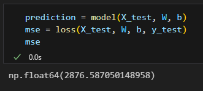
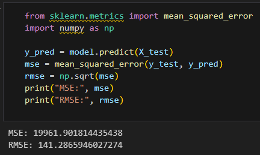

# AIFFEL Campus Online Code Peer Review Templete
- 코더 : 이완수
- 리뷰어 : 이수호

# PRT(Peer Review Template)
- [X]  **1. 주어진 문제를 해결하는 완성된 코드가 제출되었나요?**
    - 문제에서 요구하는 최종 결과물이 첨부되었는지 확인
        - 중요! 해당 조건을 만족하는 부분을 캡쳐해 근거로 첨부
              
              
    
- [ ]  **2. 전체 코드에서 가장 핵심적이거나 가장 복잡하고 이해하기 어려운 부분에 작성된 
주석 또는 doc string을 보고 해당 코드가 잘 이해되었나요?**
    - 해당 코드 블럭을 왜 핵심적이라고 생각하는지 확인
    - 해당 코드 블럭에 doc string/annotation이 달려 있는지 확인
    - 해당 코드의 기능, 존재 이유, 작동 원리 등을 기술했는지 확인
    - 주석을 보고 코드 이해가 잘 되었는지 확인
        - 중요! 잘 작성되었다고 생각되는 부분을 캡쳐해 근거로 첨부
        
- [X]  **3. 에러가 난 부분을 디버깅하여 문제를 해결한 기록을 남겼거나
새로운 시도 또는 추가 실험을 수행해봤나요?**
    - 문제 원인 및 해결 과정을 잘 기록하였는지 확인
    - 프로젝트 평가 기준에 더해 추가적으로 수행한 나만의 시도, 
    실험이 기록되어 있는지 확인
        - 중요! 잘 작성되었다고 생각되는 부분을 캡쳐해 근거로 첨부
        
- [X]  **4. 회고를 잘 작성했나요?**
    - 주어진 문제를 해결하는 완성된 코드 내지 프로젝트 결과물에 대해
    배운점과 아쉬운점, 느낀점 등이 기록되어 있는지 확인
    - 전체 코드 실행 플로우를 그래프로 그려서 이해를 돕고 있는지 확인
        - 중요! 잘 작성되었다고 생각되는 부분을 캡쳐해 근거로 첨부
        
- [X]  **5. 코드가 간결하고 효율적인가요?**
    - 파이썬 스타일 가이드 (PEP8) 를 준수하였는지 확인
    - 코드 중복을 최소화하고 범용적으로 사용할 수 있도록 함수화/모듈화했는지 확인
        - 중요! 잘 작성되었다고 생각되는 부분을 캡쳐해 근거로 첨부

# 회고(참고 링크 및 코드 개선)
- 프로젝트 1 : 목표에 만족함. 화면공유로 진행 상황을 보고할 때 여러차례 디버그를 통해 어떻게 목표를 달성할 지에 대한 고민이 보였음
    - LEARNING RATE 조정
    - epoch 조정
    - 위 2개 파라미터에 대하여 목표 달성에 맞제 값을 조정하였음
    - 산점도로 y_pred와 y_test를 출력하여 예측값과 실제값의 분포를 시각화하였음
- 프로젝트 2 : 목표에 만족함. 화면공유로 진행 상황을 보고할 때 여러차례 디버그를 통해 어떻게 목표를 달성할 지에 대한 고민이 보였음
    - 날짜 데이터에 대하여 원-핫 인코딩을 진행하였음
    - 다른 범주형 데이터에 대해서도 원-핫 인코딩을 진행하였음
        - 아쉽게도 아직 제출은 못했지만, 화면공유를 통해 진행한 걸 확인했음
    - "windspeed" 컬럼에 대해서 이상치(값이 0)가 1000개가 넘는 것을 확인하고 이 값을 예측하는 모델을 사용하여 이상치를 대체했음